# Phase 2A — Schema Alignment Architecture

Aligns `prisma/schema.prisma` with the approved Phase 0 blueprint (`docs/`) and the Phase 1B audit. This document is the design record for the aligned data model and the tracked migration. It does **not** modify any Phase 0 document or the Phase 1B audit.

**Scope of this phase:** data model + one tracked (offline-generated) migration + compatible seed. **Not** in scope: registration/login/authorization enforcement, document-extraction pipeline, AI analysis, readiness engine, business workflows, page redesigns.

---

## 1. Schema goals

1. Make the Prisma schema the **single source of truth** for the MVP data model.
2. Close every schema gap the Phase 1B audit found, per `data-dictionary.md` §12:
   - Registration approval on `User` (separate from operational status).
   - `Idea` gains `DRAFT` / `WITHDRAWN`.
   - Evidence status **split** into technical + governance fields (+ verification).
   - `DocumentAnalysis` / `AnalysisSuggestion` (AI kept separate from official data).
   - Configurable compliance (`ComplianceSection`, relational rules, `ComplianceNA`, versioning).
   - Immutability metadata on finalized decisions / verified measurements.
   - Explicit, auditable partner sharing (`ResourceShare`).
3. Keep changes **incremental, explicit, tracked, reproducible, and non-destructive** where reasonable.
4. Do **not** hard-code any DGA scoring logic into enums or application code.

## 2. Entity list

**Identity / RBAC / scope:** `User`, `Role`, `Permission`, `RolePermission`, `UserRole`, `UserMembership`, `ResourceShare`, `Account`, `Session`, `VerificationToken`.
**Organizations:** `Organization`, `Department`.
**Strategy (5.23.1):** `StrategicObjective`.
**Activities (5.23.2):** `InnovationActivity`, `ActivityOrganization`.
**Governance (5.23.3):** `Idea`, `IdeaEvaluation`, `IdeaDecision`.
**Solutions (5.24.1):** `InnovationSolution`, `SolutionOrganization`.
**Impact (5.24.2):** `ImpactIndicator`, `ImpactMeasurement`.
**Partners:** `CooperationAgreement`, `AgreementMeeting`, `AgreementSolution`, `AgreementActivity`.
**Compliance:** `ComplianceSection`, `ComplianceRequirement`, `RequirementFieldRule`, `RequirementEvidenceRule`, `ComplianceRequirementVersion`, `ComplianceNA`.
**Evidence:** `Evidence`, `EvidenceLink`.
**Document analysis:** `DocumentAnalysis`, `AnalysisSuggestion`.
**Ops:** `Alert`, `Notification`, `AuditLog`.

**New in Phase 2A (models):** `ResourceShare`, `ActivityOrganization`, `AgreementSolution`, `AgreementActivity`, `ComplianceSection`, `RequirementFieldRule`, `RequirementEvidenceRule`, `ComplianceRequirementVersion`, `ComplianceNA`, `DocumentAnalysis`, `AnalysisSuggestion`.

## 3. Relationship summary

- `User` hard-FK relations (bounded): role assignments, memberships, owned solutions, submitted ideas, evaluations, decisions (as maker), responsible agreements, uploaded evidence, assigned alerts, notifications, audit logs, registration-approver (self), and resource shares (as subject).
- `Organization 1─* Department`; both feed scope via `UserMembership`.
- `StrategicObjective 1─* InnovationSolution`; `InnovationActivity 1─* Idea` and `1─* InnovationSolution`.
- `Idea 1─* IdeaEvaluation`, `1─* IdeaDecision`, `1─0..1 InnovationSolution` (`SolutionFromIdea`).
- `InnovationSolution 1─* ImpactIndicator 1─* ImpactMeasurement`.
- `CooperationAgreement 1─* AgreementMeeting`; optional M–N to solutions/activities via `AgreementSolution` / `AgreementActivity`; M–N partner orgs via `ActivityOrganization` / `SolutionOrganization`.
- `ComplianceSection 1─* ComplianceRequirement 1─* {RequirementFieldRule, RequirementEvidenceRule, ComplianceRequirementVersion, ComplianceNA}`; `ComplianceRequirement` self-tree via `parentId`.
- `Evidence 1─* EvidenceLink` (→ optional `ComplianceRequirement`); `Evidence 1─0..1 DocumentAnalysis 1─* AnalysisSuggestion`.
- Self-relations: `User.approvedBy`, `IdeaDecision.supersedes`, `ImpactMeasurement.supersedes`, `ComplianceRequirement.parent`.

## 4. Evidence-linking strategy (decision)

**Chosen: one generic, strictly-validated `EvidenceLink` model** (over per-entity relation tables).

- `EvidenceLink(evidenceId, entityType: LinkedEntityType, entityId, requirementId?)`, unique `(evidenceId, entityType, entityId)`.
- `entityType` is a **whitelist enum**; `entityId` has **no DB foreign key** (Prisma has no polymorphic FK).
- **Validation rules (application-enforced, to be built in later phases):** before creating or exposing a link the server must verify that (a) a record of `entityType` with `entityId` exists, and (b) it is within the caller's data scope. Links are created only through the evidence service, never ad-hoc.

**Why not per-type tables:** there are 8+ linkable entity types (`COMPLIANCE_REQUIREMENT`, `STRATEGIC_OBJECTIVE`, `INNOVATION_ACTIVITY`, `IDEA`, `INNOVATION_SOLUTION`, `IMPACT_MEASUREMENT`, `COOPERATION_AGREEMENT`, `AGREEMENT_MEETING`, `REPORT`). Eight join tables + eight write paths would multiply surface area with no scope-safety benefit, since scope validation is required regardless. **Trade-off accepted:** referential integrity for `entityId` is enforced in code, not the database — documented here and in the schema comment on `EvidenceLink`. `ResourceShare`, by contrast, targets only two shareable types and therefore uses **explicit nullable FKs** (`solutionId` / `agreementId`) for real integrity.

## 5. Authorization and scope model

- **RBAC + data scope, never a bare role enum.** `UserRole` carries `scopeType ∈ {PLATFORM, ORGANIZATION, DEPARTMENT, AGREEMENT, SOLUTION, PUBLISHED}` + optional `scopeId`. A user may hold several assignments; effective rights are the union (permission ∧ scope-contains-record).
- **Registration vs operational status are separate axes:** `User.registrationStatus ∈ {PENDING, APPROVED, REJECTED}` (approval lifecycle) is independent of `User.status ∈ {ACTIVE, INACTIVE, SUSPENDED}` (operational). Public registration begins `PENDING`; `requestedRoleKey` records the asked-for role. **SYSTEM_ADMIN is never assignable via public registration** — enforced in the (future) registration/approval code, not the schema.
- **Explicit sharing** via `ResourceShare(userId, entityType, solutionId?/agreementId?, allowedActions[], allowedFields[], grantedById, revokedById?, revokedAt?)`. This backs `authorization.md` §5 field-/action-level partner restrictions. Enforcement (checking a write against `allowedFields`/`allowedActions`) is a later phase; the schema now carries the data.
- **Enforcement itself is out of scope for Phase 2A** — no middleware/guards were changed. The schema simply makes correct enforcement possible.

## 6. Compliance versioning strategy

- **Live configuration is relational**: `ComplianceRequirement` (numeric config: `requirementWeight`, `gateCeiling` default 69, `allowNA`, `isEstimated`, `entityType`) + `RequirementFieldRule[]` (per-field `weight`, `mandatoryGate`, `optional`, `rule`) + `RequirementEvidenceRule[]` (per-evidence `minCount`, `weight`, `mandatoryGate`). Sections group requirements and carry `sectionWeight`.
- **History is snapshot-based**: `ComplianceRequirementVersion(requirementId, version, snapshot: Json, createdById?)`, unique `(requirementId, version)`. On each config change the app freezes the full requirement+rules as a JSON snapshot and bumps `ComplianceRequirement.version`. This preserves prior versions for audit (`compliance-rules.md` §11) without a heavy temporal schema.
- **Mandatory gates** are modeled as boolean flags on the field/evidence rules (not a separate table) — simplest faithful representation of "this item is a gate".
- **No scoring engine here.** `compliance-rules.md` formulas remain unimplemented; only the data foundation exists. The `isEstimated` flag carries the mandatory "estimated/internal" labelling requirement into the data.

## 7. Immutability strategy

Finalized/verified records are made **write-protectable** by adding metadata (guards enforced in a later phase, per `authorization.md` L5 / `status-definitions.md` §13):

- `IdeaDecision`: `finalizedAt`, `finalizedById`, `supersedesId` (self-relation), `correctionReason`, `reopenedAt`, `reopenedById`, `reopenReason`.
- `ImpactMeasurement`: `verifiedAt`, `verifiedById`, `supersedesId` (self-relation), `reopenedAt`, `reopenedById`, `reopenReason`.
- **Archival (soft-delete) not hard delete**: `archivedAt` + `archivedById` on the key governance records (`Organization`, `Department`, `StrategicObjective`, `InnovationActivity`, `Idea`, `InnovationSolution`, `CooperationAgreement`, `Evidence`).
- `ComplianceNA` approvals and `AuditLog` provide the governed change trail. These fields were applied **selectively**, not mechanically to every model.

## 8. Migration strategy

- **Baseline preserved:** the previously-untracked `20260722005753_init` migration exactly reproduces the pre-alignment schema (verified in Phase 1B, no drift). It is kept as the baseline and now tracked.
- **Incremental migration added:** `20260722130000_align_mvp_schema` transforms the baseline into the aligned schema — pure `ALTER`/`CREATE`, no table recreation.
- **Generated OFFLINE, NOT APPLIED.** No database is reachable (`P1001` at `localhost:5433`), so `prisma migrate dev` could not run. The SQL was produced with:
  ```
  npx prisma migrate diff \
    --from-schema-datamodel <old schema snapshot> \
    --to-schema-datamodel prisma/schema.prisma --script
  ```
  This is a safe, DB-free diff. `db push` and `migrate reset` were **not** used.
- **To apply in a real environment:** provision the DB, then `npx prisma migrate deploy` (or `migrate dev` in development). Verify with `prisma migrate status`.
- **PostgreSQL apply-time caveat:** the migration both adds `IdeaStatus` values and sets `ideas.status DEFAULT 'DRAFT'`. On some PG versions a new enum value can't be used in the same transaction. If `migrate deploy` errors, split into two migrations (ADD VALUE, then SET DEFAULT). Noted in the migration header.

## 9. Breaking changes

1. **`Evidence.status` (enum `EvidenceStatus`) removed** → replaced by `fileProcessingStatus` (`FileProcessingStatus`) + `reviewStatus` (`EvidenceReviewStatus`); `verificationStatus` retained. `EvidenceStatus` enum dropped. *(Destructive column drop.)*
2. **`Evidence.fileType` removed** → `mimeType` + `classification` added.
3. **`ComplianceRequirement.requiredFields` / `requiredEvidenceTypes` (Json) removed** → relational `RequirementFieldRule` / `RequirementEvidenceRule`.
4. **`ComplianceRequirement.sectionCode` made nullable** and a real `sectionId` relation added.
5. `Idea.status` default changed `SUBMITTED → DRAFT`.

**Live-data impact: none** — no database has ever been provisioned, so these drops touch zero rows. In any future environment with data, items 1–3 would need a data-backfill step before applying.

## 10. Deferred decisions

- **Enforcement** of scope, immutability, field/action allow-lists, and audit writing → Phase 2B/2C.
- **`ComplianceSnapshot`** (historical readiness exports) intentionally **not** added — out of MVP (`data-dictionary.md` §12.7); `ComplianceRequirementVersion` covers config versioning only.
- **AuditLog `action`** kept as `String` (not an enum) to avoid over-constraining; documented value set lives in `data-dictionary.md`.
- **Soft-reference actor pattern** (see naming, below) — revisit if referential integrity on actor columns becomes required.
- **Extraction/analysis providers** (`DocumentAnalysis.provider/model`) are free-form until the AI phase picks a provider (needs KACARE data-residency sign-off).
- Whether to keep the two baseline+align migrations or squash to a clean init before first real deploy.

## 11. ERD (Mermaid)

```mermaid
erDiagram
  User ||--o{ UserRole : "assigned"
  Role ||--o{ UserRole : "granted"
  Role ||--o{ RolePermission : has
  Permission ||--o{ RolePermission : in
  User ||--o{ UserMembership : "belongs"
  Organization ||--o{ Department : contains
  Organization ||--o{ UserMembership : scopes
  Department ||--o{ UserMembership : scopes
  User ||--o{ ResourceShare : "subject of"
  InnovationSolution ||--o{ ResourceShare : "shared as"
  CooperationAgreement ||--o{ ResourceShare : "shared as"

  Department ||--o{ StrategicObjective : owns
  Department ||--o{ InnovationActivity : organizes
  InnovationActivity ||--o{ ActivityOrganization : "co-run by"
  Organization ||--o{ ActivityOrganization : participates

  InnovationActivity ||--o{ Idea : produces
  Idea ||--o{ IdeaEvaluation : has
  Idea ||--o{ IdeaDecision : has
  IdeaDecision ||--o{ IdeaDecision : supersedes
  Idea ||--o| InnovationSolution : "converts to"

  StrategicObjective ||--o{ InnovationSolution : aligns
  Department ||--o{ InnovationSolution : owns
  InnovationSolution ||--o{ SolutionOrganization : "co-owned"
  Organization ||--o{ SolutionOrganization : participates
  InnovationSolution ||--o{ ImpactIndicator : measures
  ImpactIndicator ||--o{ ImpactMeasurement : records
  ImpactMeasurement ||--o{ ImpactMeasurement : supersedes

  Organization ||--o{ CooperationAgreement : "partner in"
  CooperationAgreement ||--o{ AgreementMeeting : schedules
  CooperationAgreement ||--o{ AgreementSolution : relates
  InnovationSolution ||--o{ AgreementSolution : relates
  CooperationAgreement ||--o{ AgreementActivity : relates
  InnovationActivity ||--o{ AgreementActivity : relates

  ComplianceSection ||--o{ ComplianceRequirement : groups
  ComplianceRequirement ||--o{ ComplianceRequirement : "parent of"
  ComplianceRequirement ||--o{ RequirementFieldRule : "field rules"
  ComplianceRequirement ||--o{ RequirementEvidenceRule : "evidence rules"
  ComplianceRequirement ||--o{ ComplianceRequirementVersion : versions
  ComplianceRequirement ||--o{ ComplianceNA : "N/A determinations"

  Evidence ||--o{ EvidenceLink : "links via"
  ComplianceRequirement ||--o{ EvidenceLink : "mapped by"
  Evidence ||--o| DocumentAnalysis : "analyzed by"
  DocumentAnalysis ||--o{ AnalysisSuggestion : produces
  ComplianceRequirement ||--o{ AnalysisSuggestion : "suggested for"

  User ||--o{ Notification : receives
  User ||--o{ Alert : "assigned"
  User ||--o{ AuditLog : "acts in"
```



---

## Naming decisions & documented deviations (Task J)

- **Soft-reference actor pattern:** approver/reviewer/finalizer/verifier/archiver/granter/requester/actor id columns (`approvedById`, `reviewedById`, `finalizedById`, `verifiedById`, `archivedById`, `grantedById`, `revokedById`, `requestedById`, `createdById`, `attendanceConfirmedById`, and `AuditLog.organizationId/departmentId`) are `String?` references to `User.id`/`Organization.id`/`Department.id` **without a DB foreign key** (application-validated). Only **primary ownership** relations are hard FKs (owner, uploader, submitter, decision-maker, responsible, assignee, membership, registration-approver, share-subject). This deliberately **bounds `User` back-relations** and keeps the model readable. Trade-off: those columns rely on app-level integrity.
- **`UserMembership`** is the Task B "OrganizationMembership/equivalent".
- **Operational vs approval vs processing vs governance states are distinct enums** everywhere: `UserStatus` ≠ `RegistrationStatus`; `FileProcessingStatus` ≠ `EvidenceReviewStatus` ≠ `VerificationStatus` ≠ `DocumentAnalysisStatus`.
- **English enum/model identifiers**; approved Arabic labels stay in `...Ar` fields / the UI, never in enum identifiers.
- **Consistent conventions:** `cuid()` ids; `createdAt`/`updatedAt` on mutable records; `archivedAt`/`archivedById` for archival; `*Id` for foreign/soft references.
- **No duplicate enums:** e.g. `RecordStatus` reused for org/dept/objective/solution; `LinkedEntityType` reused for evidence links, alerts, audit, and suggestion targets.

---

## Live PostgreSQL Verification (Phase 2A.1)

The Phase 2A migration was originally generated offline (no DB then reachable). Phase 2A.1 verified it against a live PostgreSQL server from zero.

- **Environment type:** local **disposable** development database — a throwaway Docker container (`postgres:16-alpine`, throwaway credentials, port `5544`), targeted via an inline `DATABASE_URL` override so `.env` (which points at an unrelated, unreachable `:5433`) was never modified. **Not** a shared or production database; recreated from scratch, not `migrate reset`.
- **PostgreSQL version:** 16.14.
- **Migration commands:** `npx prisma migrate deploy`, `npx prisma migrate status`, `npx prisma migrate diff --from-url <db> --to-schema-datamodel prisma/schema.prisma` (drift check), `npx prisma validate`, `npx prisma generate`, `npm run db:seed`.
- **Migrations applied:** yes — all three apply cleanly from an empty database (`20260722005753_init` → `20260722130000_align_mvp_schema` → `20260722130001_ideas_status_default_draft`); `migrate status` = "Database schema is up to date"; drift check = empty (DB matches `schema.prisma`).
- **Seed ran:** yes. Verified counts (no password hashes read): 1 owner org, 2 internal departments, 1 external (UNIVERSITY) org, 4 users across all 4 role categories (SYSTEM_ADMIN/INTERNAL_EDITOR/EXTERNAL_PARTNER/VIEWER) with scopes PLATFORM/DEPARTMENT/SOLUTION/PUBLISHED; 1 each of strategic objective, activity, idea, solution, impact indicator, agreement, meeting; 2 compliance sections, 5 requirements, 1 field rule, 1 evidence rule, 1 resource share.
- **Verification results:** 12/12 schema invariants passed via a temporary (untracked, since-deleted) script — registration vs operational status separate; SYSTEM_ADMIN only via role assignment (no demo user requested it); Idea default `DRAFT` + transitions; Evidence `fileProcessingStatus` independent of `reviewStatus`; `DocumentAnalysis`+`AnalysisSuggestion` relational create; `ResourceShare` action/field arrays; requirement↔section+rules; `ComplianceNA` reason + REQUESTED→APPROVED lifecycle; finalized `IdeaDecision` superseding/reopening; verified `ImpactMeasurement` superseding; `AuditLog` before/after JSON + org/dept scope refs; `EvidenceLink` unique constraint rejects duplicates (P2002).

### Migration correction made

Applying `20260722130000_align_mvp_schema` initially failed on live PostgreSQL with **`55P04` — "unsafe use of new value 'DRAFT' of enum type IdeaStatus"**: the documented caveat was real. That migration both `ADD VALUE 'DRAFT'` to `IdeaStatus` and `SET DEFAULT 'DRAFT'` on `ideas.status` in the same transaction, which PostgreSQL forbids (a new enum value must be committed before use).

**Fix (migration-only, history-preserving):** the `SET DEFAULT 'DRAFT'` statement was moved out of `20260722130000_align_mvp_schema` into a new follow-up migration **`20260722130001_ideas_status_default_draft`**, so the enum value is committed by the prior migration before it is used. The `ADD VALUE` statements remain in the align migration. No existing migration was deleted or renamed; the schema and seed were unchanged. After the split, all three migrations apply cleanly and there is no drift.

### Remaining limitations

- Verification used PostgreSQL 16.14; the managed cloud target version should be confirmed in deployment (behavior is expected to be identical for PG 12+).
- The disposable container is ephemeral and not committed; a reviewer reproduces it with the Task E sequence (`npm install` → `npx prisma generate` → `npx prisma migrate deploy` → `npm run db:seed`) against their own `DATABASE_URL`.
- Enforcement (scope/immutability/audit-writing) remains schema-only — deferred to Phase 2B/2C, unchanged by this phase.
