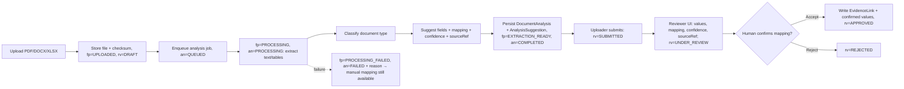

# AI Document Analysis Blueprint — منصة إدارة الابتكار المؤسسي

A **bounded, human-in-the-loop** assistant that reads an uploaded evidence file and *suggests* structured field values and a compliance-requirement mapping. It accelerates evidence mapping; it never governs.

> This is the platform's only AI feature and it exists for a defined business purpose: reduce manual evidence entry while keeping a human as the sole authority. It satisfies the product principle that AI "must not make final governance or compliance decisions autonomously."

---

## 1. Hard boundaries

**The AI MAY:** extract text/tables, classify a document, **suggest** field values, **recommend** a requirement mapping, and attach a confidence score.

**The AI MAY NOT:** approve or reject evidence, move `Evidence.reviewStatus` to `APPROVED`, modify any official record, set compliance readiness, verify impact, or take any action without an explicit human confirmation.

Every AI output is stored **separately** from confirmed record values (`AnalysisSuggestion` rows) until a human accepts it.

## 1A. Three separate statuses — extraction success ≠ approval (correction #3)
The pipeline touches **three independent** status concepts (full definitions in `status-definitions.md` §10–§12):
- **`Evidence.fileProcessingStatus`** (technical): `UPLOADED → PROCESSING → EXTRACTION_READY` / `PROCESSING_FAILED`.
- **`DocumentAnalysis.status`** (AI job): `QUEUED → PROCESSING → COMPLETED` / `FAILED`.
- **`Evidence.reviewStatus`** (governance): `DRAFT → SUBMITTED → UNDER_REVIEW → APPROVED` / `REJECTED` / `ARCHIVED` — **the only one that affects readiness.**

A file reaching `EXTRACTION_READY`, and an analysis reaching `COMPLETED`, mean only that suggestions are ready for a human. **They never make the evidence `APPROVED`.** Approval is a separate, human, `evidence.approve` action.

---

## 2. Supported MVP formats & per-format strategy

### 2.1 PDF
- **Extraction:** text-layer extraction first (e.g. `pdf-parse`/`pdfjs`). If the page has no text layer (scanned), mark `needsOCR = true`; OCR is **future scope** — for MVP, a scanned PDF yields low/zero text and falls back to manual mapping with a clear message.
- **Classification:** by extracted keywords + filename + the record it was uploaded to (context prior).
- **Suggested fields:** title/date, document type (memo/report/agreement), references to solution/agreement codes.
- **Confidence:** text-coverage ratio × classifier score.
- **Human review:** always. Low text coverage → flagged.
- **Errors:** encrypted/corrupt/oversized → `FAILED` + reason; manual mapping remains available.

### 2.2 DOCX
- **Extraction:** parse document XML (e.g. `mammoth`/`docx`), preserving headings and tables.
- **Classification:** heading/section heuristics + keywords.
- **Suggested fields:** title, author/section metadata, dates, referenced record codes, candidate requirement (from headings like "الأثر", "الاعتماد").
- **Confidence:** structure richness × classifier score.
- **Human review:** always.
- **Errors:** password-protected/unsupported → `FAILED` + reason.

### 2.3 XLSX — structured tabular workbooks only (correction #10)
- **MVP scope:** **structured tabular workbooks only** — a clear header row over regular data rows. **Out of MVP:** complex formulas, macros (`.xlsm`), embedded objects/charts, protected/encrypted sheets, pivot caches, merged-cell layouts, and arbitrary/free-form workbook interpretation. Such workbooks are flagged `unsupportedStructure` and routed to manual mapping.
- **Extraction:** read sheets/cells (e.g. `exceljs`/`xlsx`); detect a single header row + contiguous tabular block. Formula cells are read as their **last cached value only** (formulas are not evaluated).
- **Classification:** sheet/column-name heuristics (e.g. baseline/target/actual → impact data).
- **Suggested fields:** candidate `ImpactMeasurement` rows (baseline/target/actual/unit/period) and indicator names — presented as a **preview table** for the reviewer to accept row-by-row.
- **Confidence:** header-match ratio × value-type validity.
- **Human review:** always; each mapped row is individually confirmable.
- **Errors / unsupported:** protected/macro/embedded/irregular workbook → `FAILED` or `unsupportedStructure` + reason; manual mapping remains available.

---

## 3. Pipeline

Legend: `fp` = `Evidence.fileProcessingStatus` · `an` = `DocumentAnalysis.status` · `rv` = `Evidence.reviewStatus`.

Note how the three statuses move independently: extraction completing sets `fp=EXTRACTION_READY` / `an=COMPLETED`, but **`rv` only reaches `APPROVED` by a human** with `evidence.approve`.

Analysis runs **asynchronously** (job/queue) so uploads never block the UI. MVP may implement the "queue" as a background route/worker; the contract is that the UI polls or subscribes to the `DocumentAnalysis` status.

---

## 4. Data model (delta — see `data-dictionary.md` §12)

- **`DocumentAnalysis`** — `id, evidenceId, format(PDF|DOCX|XLSX), status(QUEUED|PROCESSING|COMPLETED|FAILED), provider, model, extractorVersion, promptVersion?, processedAt, error?, createdAt, completedAt`.
- **`AnalysisSuggestion`** — `id, analysisId, kind(FIELD|REQUIREMENT_MAP|IMPACT_ROW), fieldKey?, suggestedValue(Json), targetEntityType?, suggestedRequirementId?, confidence(0..1), sourceRef(Json: page/section/cell/textRange), reviewOutcome(PENDING|ACCEPTED|EDITED|REJECTED default PENDING), editedValue(Json?), reviewedById?, reviewedAt?`.

Keeping suggestions in their own table guarantees the official record is only ever written on human acceptance and preserves a full trail of what the AI proposed vs. what a human accepted.

## 4A. Traceability — every analysis result must preserve (correction #9)
For each analysis and each suggestion, the following are recorded and viewable:

| Field | Where |
|---|---|
| Analysis provider / model | `DocumentAnalysis.provider`, `.model` |
| Extractor or prompt version | `DocumentAnalysis.extractorVersion`, `.promptVersion` |
| Processing timestamp | `DocumentAnalysis.processedAt` / `.completedAt` |
| Source reference (page / section / cell / text range) | `AnalysisSuggestion.sourceRef` (best-effort per format) |
| Confidence score | `AnalysisSuggestion.confidence` |
| Reviewer | `AnalysisSuggestion.reviewedById` |
| Review timestamp | `AnalysisSuggestion.reviewedAt` |
| Accepted / edited / rejected | `AnalysisSuggestion.reviewOutcome` (+ `editedValue` when edited) |
| Error details | `DocumentAnalysis.error` (on `FAILED`) |

This gives a complete "what the AI said, from where, with what confidence, and what the human did about it" trail for every value that ever influences an official record.

---

## 5. Confidence scoring

- Range `0.0–1.0`, stored per suggestion.
- Displayed as three bands: **مرتفعة** (≥0.85), **متوسطة** (0.7–0.85), **منخفضة** (<0.7, configurable threshold).
- Confidence **only** guides the reviewer. It never auto-accepts, never affects readiness, and low-confidence items cannot be bulk-accepted.

---

## 6. Human review UX contract

- Side-by-side: extracted value ↔ target field, with confidence badge and a source snippet/cell reference.
- Reviewer can edit any suggested value before accepting.
- Reviewer must pick/confirm the requirement mapping; a pre-selected suggestion is allowed but must be explicitly confirmed.
- "Accept all high-confidence" is permitted **only** for ≥ threshold items; low-confidence items require individual action.
- On approval: confirmed values are written, `EvidenceLink(s)` created, `Evidence.reviewStatus=APPROVED`, each suggestion's `reviewOutcome` set (`ACCEPTED`/`EDITED`/`REJECTED`), `AuditLog(EVIDENCE_APPROVED)`, readiness recompute triggered.

---

## 7. Error handling & fallbacks

| Failure | Behaviour |
|---|---|
| Unsupported/oversized/corrupt file | Reject at upload with clear message (before analysis) |
| Extraction/classification error | `DocumentAnalysis.status=FAILED` + reason; `Evidence.fileProcessingStatus=PROCESSING_FAILED`; manual mapping offered; `reviewStatus` unaffected (stays `DRAFT`) |
| Scanned PDF (no text) | Flag `needsOCR`; low/zero suggestions; manual mapping; OCR is future scope |
| Unsupported XLSX structure (macros/protected/embedded/irregular) | Flag `unsupportedStructure`; route to manual mapping |
| Model/service unavailable | `fileProcessingStatus` stays `UPLOADED`, `an` stays `QUEUED`; retry allowed; manual mapping always available |
| Partial extraction | Suggest what was found; mark the rest as gaps |

**Guarantee:** AI/extraction failure never blocks the core journey — a human can always map evidence manually and reach `reviewStatus=APPROVED`. Extraction success never auto-approves.

---

## 8. Privacy, security & provenance

- Evidence often contains sensitive institutional data. Analysis runs server-side; files are never exposed publicly.
- Store `provider` + `model` + `extractorVersion`/`promptVersion` + timestamps + per-suggestion `sourceRef` on each analysis for auditability and reproducibility (see §4A).
- If an external model/service is used, that is a decision requiring KACARE approval (data residency); MVP should prefer a self-hostable/local extraction path where feasible (see open questions in the deliverables). No evidence content is sent to third parties without explicit sign-off.
- Access to a file (and its analysis) obeys the same data scope as the record it is linked to.

---

## 9. Out of scope (analysis)

- OCR for scanned documents (future).
- Cross-document reasoning, summarization of governance outcomes, or free-form Q&A/RAG.
- Automatic record creation without human confirmation.
- Non-MVP formats (images, PPTX, email ingestion).
