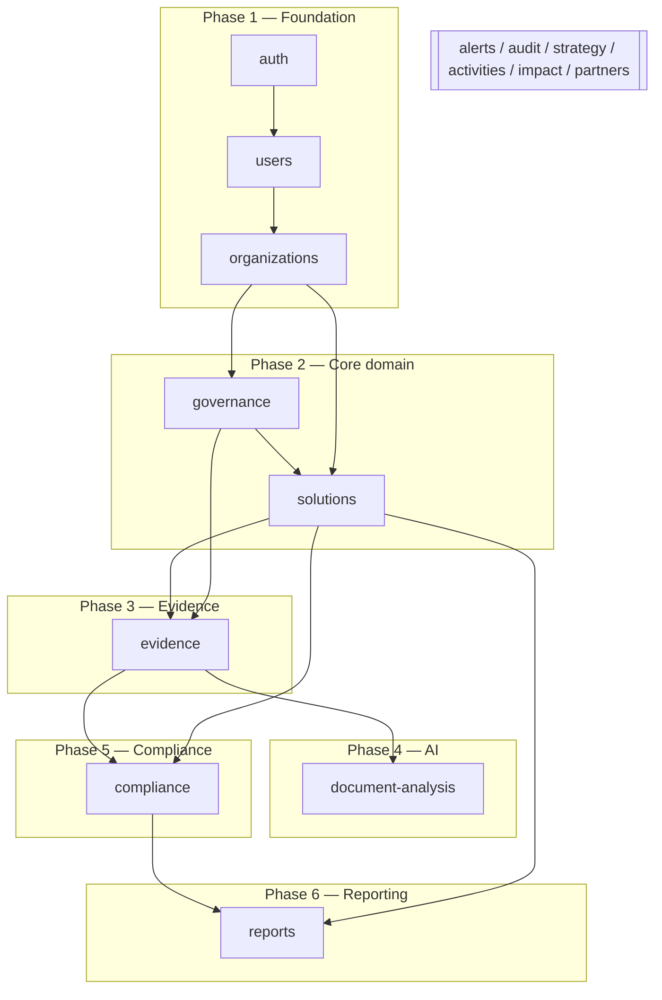

# MVP Module List — منصة إدارة الابتكار المؤسسي

Modules are organized by domain (matching `src/modules/*`) and grouped into build phases. Each phase is shippable and unblocks the next. Dependencies are explicit so the team never builds against a missing foundation.

---

## 1. Phase map

---

## 2. Modules by phase

### Phase 1 — Foundation (must be first)
| Module | Purpose | Depends on |
|---|---|---|
| **auth** | Auth.js credentials login, session→principal, registration (PENDING), route protection | — |
| **users** | User list, Admin approval/reject, role + scope assignment | auth |
| **organizations** | Owner org, departments, partner orgs, memberships (feeds scope) | auth, users |

**Exit criteria:** register → admin approve → login → scoped session works; RBAC guards + scope filter live in `src/server/`.

### Phase 2 — Core domain (all five DGA modules are core — correction #5)
| Module | Purpose | Depends on |
|---|---|---|
| **strategy** (5.23.1) | `StrategicObjective` CRUD; solutions align to objectives | organizations |
| **activities** (5.23.2) | `InnovationActivity` CRUD; activities produce ideas/solutions | organizations |
| **governance** (5.23.3) | Ideas, evaluations, decisions, persisted Kanban; convert to solution | organizations, activities |
| **solutions** (5.24.1) | Solutions registry, ownership, strategic alignment, completeness % | strategy, governance |
| **impact** (5.24.2) | `ImpactIndicator` + `ImpactMeasurement` (baseline/target/actual, verification) | solutions |

**Exit criteria:** all five DGA modules exist with their core entities; idea → evaluate → approve → convert to a persisted solution linked to a strategic objective and (optionally) an activity; at least one impact indicator + measurement can be recorded; registry shows missing-fields. *(Advanced analytics within strategy/activities/impact may be deferred, but the entities + boundaries ship here — the MVP must not be only ideas/solutions/evidence.)*

### Phase 3 — Evidence
| Module | Purpose | Depends on |
|---|---|---|
| **evidence** | Upload, polymorphic `EvidenceLink`, manual mapping, approve → readiness input | solutions, governance |

**Exit criteria:** upload evidence, map to a record/requirement manually, approve; scope-checked download.

### Phase 4 — Document analysis (AI)
| Module | Purpose | Depends on |
|---|---|---|
| **document-analysis** | Async extract/classify/suggest for PDF/DOCX/XLSX; human review UI | evidence |

**Exit criteria:** upload → analysis → suggestions with confidence → human approves mapping (AI never auto-approves).

### Phase 5 — Compliance
| Module | Purpose | Depends on |
|---|---|---|
| **compliance** | Configurable `ComplianceRequirement`, readiness engine, gap reports, on-screen compliance file | evidence, solutions |

**Exit criteria:** admin configures a requirement (no code change); readiness computes from approved evidence + fields; deep links to sources.

### Phase 6 — Reporting
| Module | Purpose | Depends on |
|---|---|---|
| **reports** | Dashboards (readiness, counts, trends), recent activity; (export package = future) | compliance, solutions |

**Exit criteria:** dashboards reflect live readiness/counts; master journey visibly updates the dashboard.

---

## 3. Cross-cutting modules (built incrementally alongside phases)

| Module | Introduced | Purpose |
|---|---|---|
| **partners** | P3 | Partner orgs, agreements, meetings (+ their evidence, alerts) |
| **alerts** | from P2 | Rule-generated alerts on time/action obligations |
| **audit** | from P1 | Append-only audit log on significant actions |

> **Note (correction #5):** `strategy`, `activities`, and `impact` are **core Phase-2 modules** (see above), not deferred cross-cutting add-ons. `impact` deepens further in P4 (XLSX analysis feeds measurements) and P5 (impact-dependent requirements), but its entities ship in P2.

`alerts` and `audit` are wired from Phase 1 onward (every mutating action audits; obligations raise alerts) rather than bolted on at the end.

---

## 4. Dependency rules

1. **No module skips its dependencies.** Evidence cannot be built before solutions/governance exist to attach to.
2. **Authorization is a Phase-1 platform primitive** (`src/server/`), consumed by every later module — never re-implemented per module.
3. **Compliance depends on approved evidence**, so it lands after evidence (P3) and analysis (P4) even though it is the product's headline outcome.
4. **Reports read everything** and therefore come last.
5. **Cross-cutting modules** (strategy/activities/impact/partners/alerts/audit) are thin at first and deepen as their host phase matures.

---

## 5. Mapping to DGA areas

| DGA area | Primary module(s) |
|---|---|
| 5.23.1 Strategic direction | strategy |
| 5.23.2 Methodologies & activities | activities |
| 5.23.3 Innovation governance | governance |
| 5.24.1 Solutions registry | solutions |
| 5.24.2 Impact measurement | impact |
| Supporting: partners/evidence/compliance/alerts/reports/audit | respective modules |

---

## 6. Build status (as of this integration — see `changelog.md` for detail)

| Module | Status | Notes |
|---|---|---|
| **strategy** | Objectives: built and live (existing table). Assignment/StrategyDocument: built, code-complete, **pending migration deploy** | See `database-freeze.md` for the Assignment/Document design |
| **activities** | Built and live (existing table), including per-activity evidence upload | — |
| **governance** (ideas) | Built and live, including archive/restore | — |
| **governance** (committees) | Built, code-complete, **pending migration deploy** | New tables: `Committee`, `CommitteeMember`, `CommitteeMeeting` |
| **challenges** | Built, code-complete, **pending migration deploy** | New tables: `Challenge`, `ChallengeSolution` |
| **solutions** | Pre-existing, mature; extended only with a read-only "linked challenges" card | — |
| **evidence** | Pre-existing, mature; extended additively with activity- and strategy-document-scoped upload paths (original solution-evidence code untouched) | — |
| **compliance** | Solutions/impact readiness pre-existing; strategy/activities/governance readiness cards added, reading from the modules above | — |
| **alerts** | UI built and wired to real `Alert`/`Notification` data; **no automatic alert-generation logic exists yet** (nothing populates `Alert` rows automatically) | Known gap, not in current scope |
| **admin/users** | Registration-approval pre-existing; user list + platform-scope role assignment added | Department/organization/agreement-scoped role assignment UI not built |
| **audit** | Read-only log viewer added over the pre-existing `AuditLog` table | — |
| **reports** | Live cross-module counters added; no scheduled/exportable report artifacts | — |
| **impact**, **partners** | Still placeholder pages, as originally planned in this document | Out of the current integration's scope |
