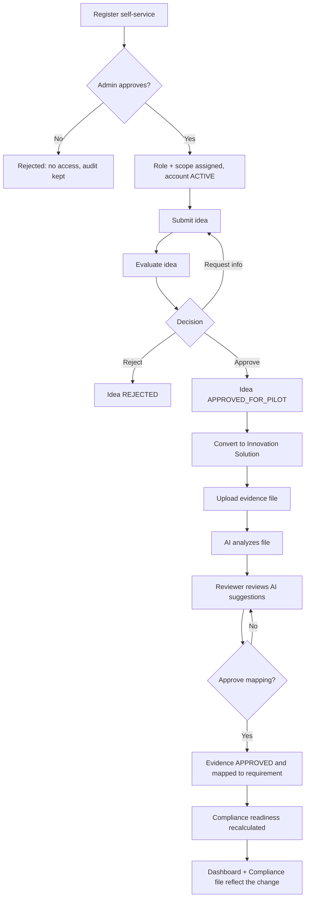
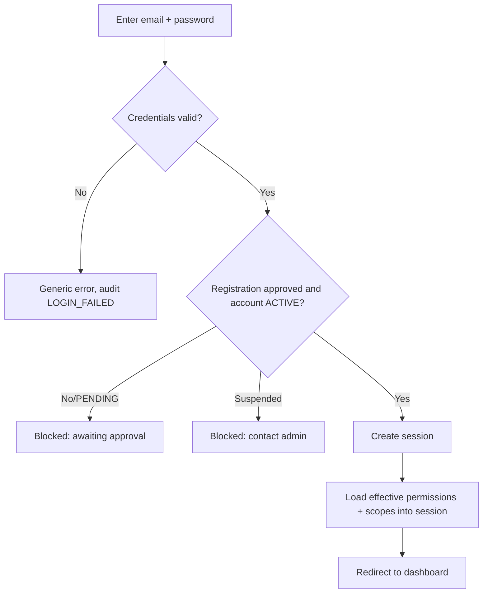
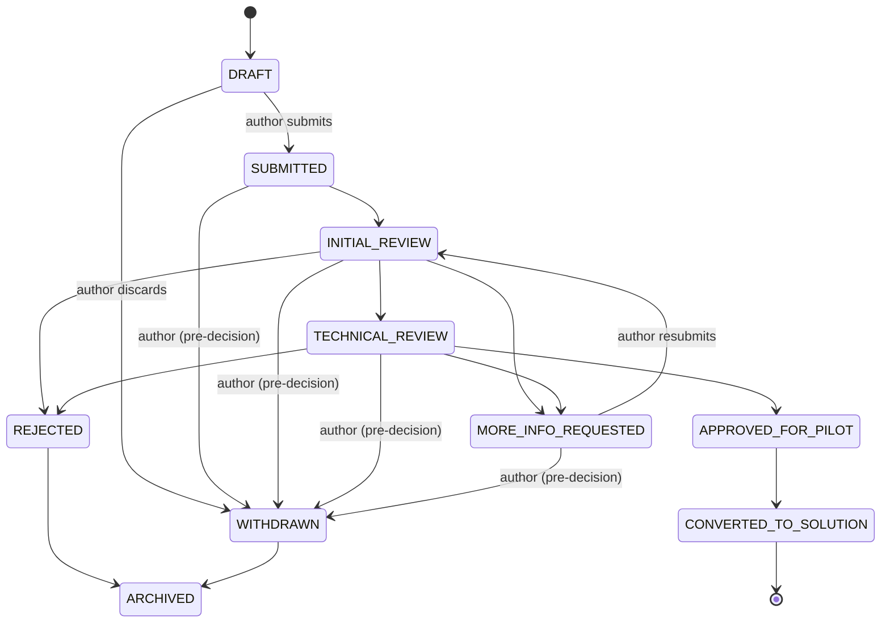
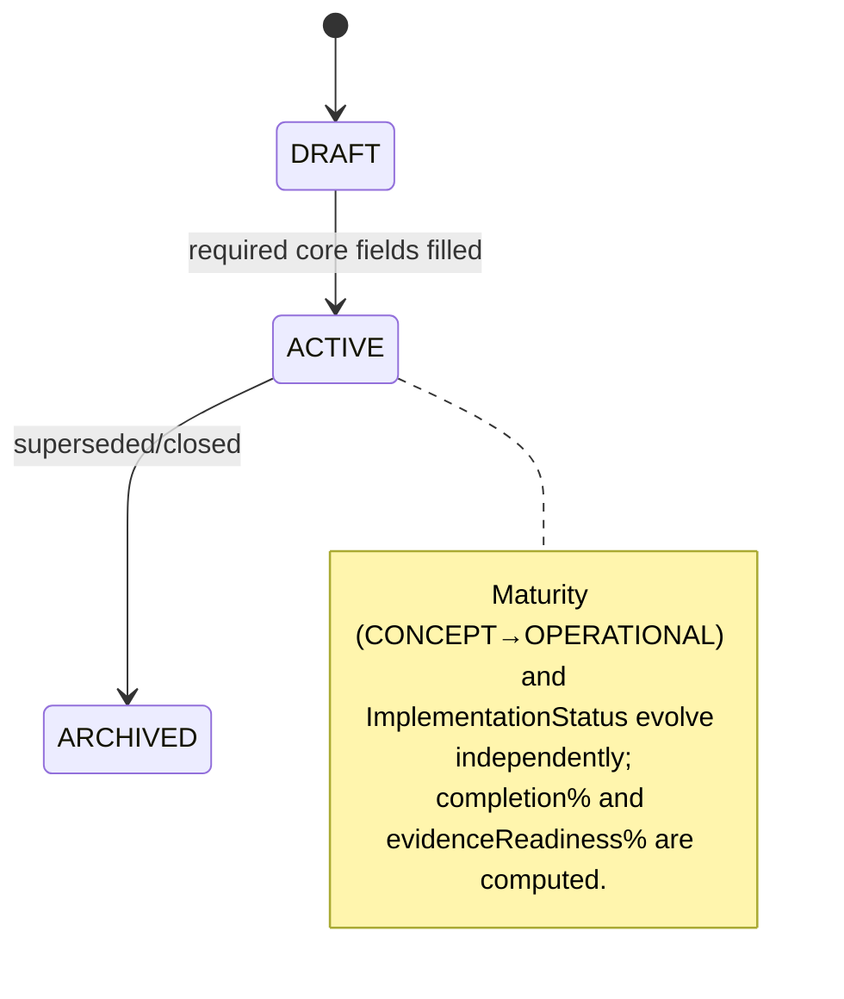
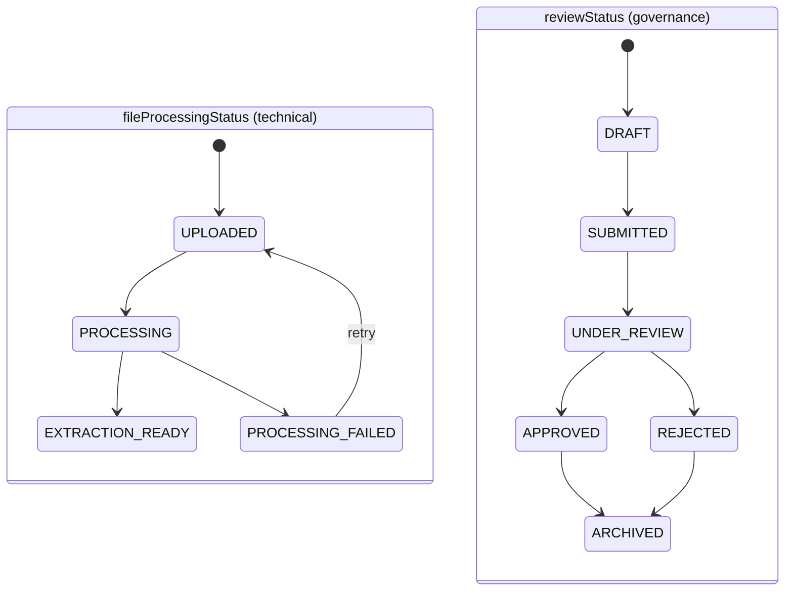
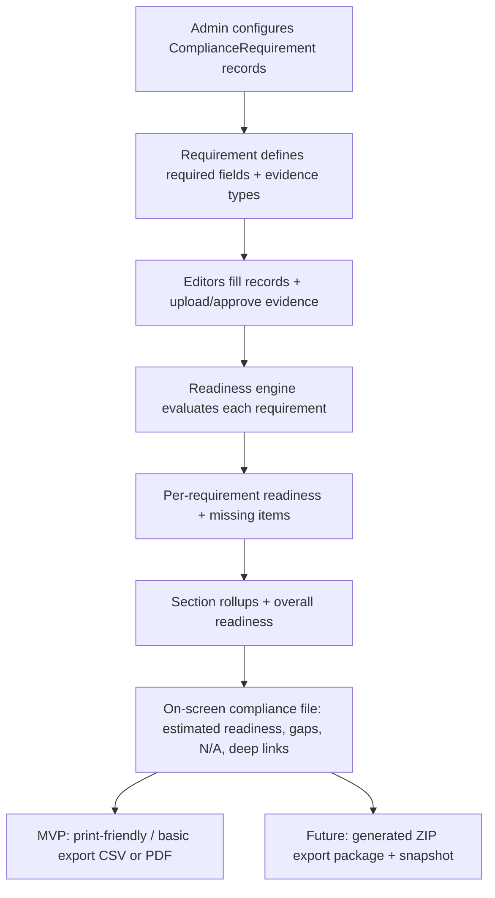

# User Journeys — منصة إدارة الابتكار المؤسسي

End-to-end journeys for the MVP, with Mermaid diagrams. These are the behavioural contract the engineering team implements. Statuses referenced here are defined in `status-definitions.md`; authorization gates are defined in `authorization.md`.

---

## 0. The master journey (MVP acceptance thread)



---

## 1. Registration

```mermaid
sequenceDiagram
  actor U as New user
  participant App as Platform (server)
  participant DB as PostgreSQL
  U->>App: Submit registration (name, email, requested role in {Editor, Partner, Viewer})
  App->>App: Validate (Zod); reject if requested role = SYSTEM_ADMIN
  App->>DB: Create User(status=PENDING approval), no role assignment
  App->>DB: AuditLog(REGISTER_REQUEST)
  App-->>U: "Awaiting administrator approval"
```

**Rules**
- Requested role is a *request*, not a grant. Effective access = none until approved.
- `SYSTEM_ADMIN` is never selectable.
- Duplicate email → validation error (no account enumeration in the message).

---

## 2. Login



**Rules**
- Session carries `userId` only as identity; permissions/scopes are resolved server-side per request (never trusted from the client).
- Architecture is Entra-ID-ready: the credentials provider can be swapped/added-to without changing downstream authorization.

---

## 3. Admin approval flow

```mermaid
sequenceDiagram
  actor A as System Administrator
  participant App as Platform
  participant DB as PostgreSQL
  A->>App: Open "Pending registrations"
  App->>DB: List Users where registration = PENDING (Admin scope)
  A->>App: Approve user X → choose Role + Scope(type,id)
  App->>DB: Create UserRole(role, scopeType, scopeId); set account ACTIVE
  App->>DB: AuditLog(USER_APPROVED, actor=A, target=X)
  App-->>A: Confirmation
  Note over A,App: Reject path sets registration=REJECTED + AuditLog(USER_REJECTED)
```

---

## 4. Idea lifecycle (governance 5.23.3)



**Rules & actors** (full transition→actor table in `status-definitions.md` §4.1)
- `DRAFT` is author-only pre-governance; `DRAFT → SUBMITTED` and any `→ WITHDRAWN` are **author-initiated** and `WITHDRAWN` is valid **only before a final decision**.
- Each governance transition writes an `IdeaEvaluation` and/or `IdeaDecision` + `AuditLog`.
- `idea.evaluate` moves a card through review; only `idea.decide` may `APPROVE_FOR_PILOT`, `REJECT`, or `CONVERT_TO_SOLUTION`.
- The Kanban board is a **projection** of `IdeaStatus`; dragging issues a server action that persists the transition **and enforces the actor rules** (a reviewer cannot withdraw; an author cannot approve).
- Conversion creates exactly one `InnovationSolution` linked back to the idea (`ideaId` unique).
- A **finalized** `IdeaDecision` is immutable — changes go through correction / superseding / documented reopening (see `status-definitions.md` §13).

---

## 5. Innovation solution lifecycle (5.24.1)



**Rules**
- A solution may originate from an activity, an internal proposal, or an external partnership (`SolutionSource`).
- `completionPct` reflects required-field completeness; `evidenceReadinessPct` reflects approved evidence mapped to its requirements.
- Archival is soft (`archivedAt`); no hard delete.
- The registry shows, per solution, the exact missing fields/evidence blocking "usable as formal evidence".

---

## 6. Evidence lifecycle — three separate statuses (correction #3)

Evidence carries **two** independent status fields, and the AI job has its **own** status — never one combined enum:



`DocumentAnalysis.status` (the AI job) runs `QUEUED → PROCESSING → COMPLETED | FAILED` alongside these.

**Rules**
- Evidence counts toward readiness **only** when `reviewStatus = APPROVED`.
- `evidence.upload` creates it (`reviewStatus=DRAFT`); `evidence.approve` is required to reach `APPROVED`.
- **A successfully extracted file (`fileProcessingStatus=EXTRACTION_READY`) is NOT automatically approved** — approval is a separate human governance step.
- Manual mapping (no AI) is always available: an item can go `DRAFT → SUBMITTED → UNDER_REVIEW → APPROVED` without any successful extraction.
- Every evidence item links to ≥1 business record via `EvidenceLink(entityType, entityId)` and optionally a `ComplianceRequirement`.

> **Schema delta:** the current `EvidenceStatus` enum is single/combined. The target splits into `Evidence.fileProcessingStatus` + `Evidence.reviewStatus` + `DocumentAnalysis.status`. Tracked in `data-dictionary.md` §12. Blueprint only — no schema change in this phase.

---

## 7. File-analysis lifecycle (AI, human-in-the-loop)

```mermaid
sequenceDiagram
  actor E as Editor
  participant App as Platform
  participant Q as Analysis worker
  participant AI as Extraction/Classification
  participant R as Reviewer (approver)
  E->>App: Upload file (PDF/DOCX/XLSX) to record
  App->>App: Store file + checksum; fileProcessingStatus=UPLOADED, reviewStatus=DRAFT
  App->>Q: Enqueue analysis job (status=QUEUED)
  Q->>AI: Extract text/tables + classify (fp=PROCESSING, an=PROCESSING)
  AI-->>Q: Fields + suggested mapping + confidence + sourceRef
  Q->>App: Persist DocumentAnalysis + suggestions; fp=EXTRACTION_READY, an=COMPLETED
  R->>App: Open suggestions (values, mapping, confidence, sourceRef); reviewStatus=UNDER_REVIEW
  R->>App: Edit/accept fields; confirm mapping
  App->>App: reviewStatus=APPROVED; write EvidenceLink(s); set suggestion reviewOutcome
  App->>App: AuditLog(EVIDENCE_APPROVED); trigger readiness recompute
```

**Guardrails**
- AI outputs are **suggestions with confidence only**. No suggestion changes an official record until a human confirms. `EXTRACTION_READY`/`COMPLETED` ≠ `APPROVED`.
- Low-confidence fields are flagged; the reviewer must explicitly accept them (cannot bulk-accept).
- All AI-suggested values are stored separately (`AnalysisSuggestion`) with full traceability — provider/model, extractor/prompt version, timestamp, source page/section/cell, confidence, reviewer, review timestamp, and accepted/edited/rejected outcome (see `document-analysis.md` §4A).

---

## 8. Compliance lifecycle



**Rules**
- Requirements are **data** (`ComplianceRequirement`), versioned and activatable — never hard-coded. Weights, mandatory gates, optional criteria, and `allowNA` are per-requirement configuration.
- Readiness is an **internal estimated score** (labelled as such) until DGA methodology is confirmed; it recomputes when scored fields, approved-evidence sets, requirement config, or approved N/A states change.
- **N/A is never automatic**: absence of a record is a gap by default; N/A requires reason + authorized user + approval + audit (see `compliance-rules.md` §4).
- Every requirement row deep-links to originating records.
- **MVP compliance file includes:** requirement readiness, missing data, missing evidence, missing records, validation errors, N/A state, deep links, **and a print-friendly / basic exportable report**. ZIP package + snapshots are future scope.

---

## 9. Cross-cutting: alerts & audit on every journey

- Any journey step that creates a time obligation (agreement expiry, meeting due, evaluation deadline, missing evidence) generates an **Alert** assigned to the responsible user with a deep link.
- Any journey step that is significant (create/update/archive/status-change/approve/reject/export/role-change) writes an **AuditLog** entry (actor + entity + timestamp + summary).
